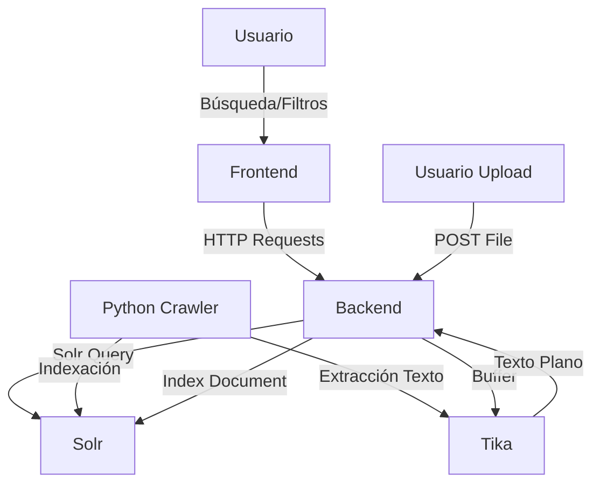

# Documentación Técnica del Sistema de Búsqueda

## 1. Visión General
El sistema es una solución de búsqueda distribuida diseñada para indexar y recuperar información en español desde múltiples fuentes (web y archivos locales). Utiliza una arquitectura de microservicios contenerizada.

### Tecnologías
- **Apache Solr 9.4**: Motor de búsqueda central.
- **Node.js (Express)**: API Gateway y lógica de negocio.
- **React (Vite)**: Interfaz de usuario.
- **Python (Scrapy/Requests)**: Crawler web.
- **Apache Tika**: Extracción de texto de documentos (PDF, DOCX).
- **Docker Compose**: Orquestación de contenedores.

---

## 2. Arquitectura del Sistema

### Diagrama de Flujo de Datos

---

## 3. Componentes Detallados

### 3.1. Apache Solr (Motor de Búsqueda)
Configurado específicamente para el idioma español.

**Schema (`managed-schema.xml`)**:
- **Tipos de Campo**:
    - `text_es`: Tokenizer estándar + Lowercase + Stopwords (es) + Sinónimos + Stemming (SpanishLight).
    - `text_spell`: Tokenizer estándar + Lowercase (para sugerencias).
- **Campos Principales**:
    - `id`: Identificador único (URL o nombre de archivo).
    - `title`: Título del documento (`text_es`).
    - `content`: Contenido principal (`text_es`).
    - `category`: Faceta (`web` o `file`).
    - `file_type`: Faceta (`html`, `pdf`, `document`).
    - `spell`: Campo copiado de `title` y `content` para el corrector ortográfico.

**Configuración (`solrconfig.xml`)**:
- **Handler `/select`**: Configurado con `edismax` para búsquedas ponderadas (`title^2.0`, `content^1.0`).
- **Handler `/suggest`**: Utiliza `FuzzyLookupFactory` y `HighFrequencyDictionaryFactory` sobre el campo `spell` para autocompletado y corrección.
- **Handler `/spell`**: Componente dedicado para verificación ortográfica.

**Responsabilidades**:
- Indexar documentos con análisis lingüístico (stemming, stopwords, sinónimos).
- Ejecutar consultas de búsqueda ponderadas.
- Proveer sugerencias de autocompletado y corrección ortográfica.
- Gestionar facetas y filtrado de resultados.

### 3.2. Backend (API Node.js)
Expone endpoints REST para el frontend. Puerto: `5001`.

**Endpoints**:
- `GET /api/search`: Realizar búsquedas en Solr.
- `POST /api/search/clear`: Eliminar todos los documentos del índice.
- `GET /api/suggest`: Proxy para el autocompletado de Solr.
- `POST /api/upload`: Recibir archivos (multipart/form-data) e indexarlos vía Tika.
- `GET /api/crawler/seeds`: Obtener lista de URLs semilla.
- `POST /api/crawler/seeds`: Actualizar lista de URLs semilla.
- `POST /api/crawler/run`: Iniciar proceso de crawling.
- `GET /api/crawler/status`: Consultar estado del crawler.

**Responsabilidades**:
- Orquestar la comunicación entre el Frontend, Solr y el Crawler.
- Gestionar la subida y procesamiento de archivos (Tika).
- Almacenar y servir la configuración de semillas del crawler.
- Exponer una API unificada para el cliente.

### 3.3. Crawler (Python Flask)
Servicio web para la indexación bajo demanda.

**Lógica**:
1. Exponer endpoint `POST /crawl`.
2. Leer URLs semilla desde la API del Backend.
3. Realizar peticiones HTTP a las semillas.
4. Procesar contenido:
    - HTML: Extraer título y texto con BeautifulSoup.
    - PDF/DOCX: Enviar a Tika para extracción.
5. Enviar documentos procesados a Solr.
6. Mantener estado de ejecución para monitoreo.

**Responsabilidades**:
- Navegar recursivamente por las URLs semilla.
- Extraer texto limpio de páginas HTML y documentos enlazados.
- Normalizar los datos al formato esperado por Solr.
- Enviar documentos directamente al índice de Solr.

### 3.4. Frontend (React)
Interfaz de usuario moderna.

**Características**:
- **Búsqueda en tiempo real**: Visualizar sugerencias al escribir.
- **Facetas**: Filtrar dinámicamente por categoría y tipo.
- **Gestión de Semillas**: Modal para editar URLs y ejecutar el crawler.
- **Limpieza**: Opción para vaciar el índice completamente.
- **Subida**: Modal para cargar archivos locales.
- **Paginación**: Visualización de resultados dividida en páginas de 10 elementos.

**Responsabilidades**:
- Presentar una interfaz amigable e intuitiva al usuario.
- Gestionar el estado de la búsqueda y los filtros seleccionados.
- Visualizar los resultados y sugerencias de forma clara.
- Permitir la administración básica del sistema (crawler, limpieza).

---

## 4. Flujos de Trabajo

### Búsqueda
1. Usuario escribe "vulmerabilidades".
2. Frontend llama a `GET /api/search?q=vulmerabilidades`.
3. Backend consulta Solr.
4. Solr no encuentra documentos exactos pero el componente `SpellCheck` sugiere "vulnerabilidades".
5. Backend retorna resultados vacíos pero incluye `didYouMean: "vulnerabilidades"`.
6. Frontend muestra "¿Quisiste decir: **vulnerabilidades**?".

### Indexación de Archivos
1. Usuario sube `reporte.pdf`.
2. Backend recibe el archivo en memoria (Multer).
3. Backend llama a Tika (`PUT /tika`) con el buffer.
4. Tika retorna el texto extraído.
5. Backend construye un objeto JSON Solr y lo envía a `/update/json/docs`.
6. Documento disponible para búsqueda inmediatamente.
